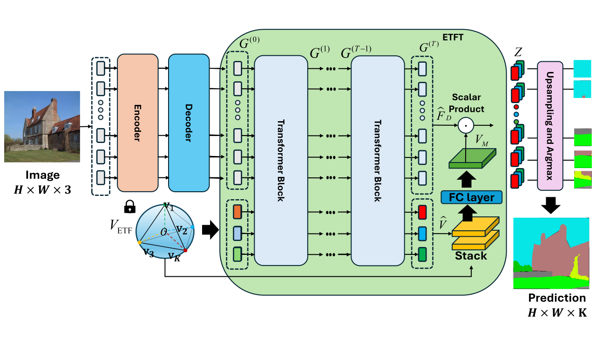

# ETFT (Equiangular Tight Frame Transformer)

This project implements "ETFT: Equiangular Tight Frame Transformer for Imbalanced Semantic Segmentation".
---


## Table of Contents
- [Installation](#installation)
- [Training](#training)
- [Testing](#testing)
- [Results](#results)
- [Acknowledgements](#acknowledgements)

---

## Installation

```bash
git clone https://github.com/seonggyuny/ETFT.git
```

Install the necessary packages:

```bash
pip install -r requirements.txt
```


## Training

To train the model, use the following command:

```bash
python -m segm.train --log-dir ETFT_tiny_mask --dataset ade20k \
  --backbone vit_tiny_patch16_384 --decoder ETFT
```

## Testing

After training, you can test the model using:

```bash
python -m segm.eval.miou ETFT_tiny_mask/checkpoint.pth ade20k --singlescale
```

## Results

TODO

## Acknowledgements

This code is based on https://github.com/rstrudel/segmenter.
Strudel, Robin, et al. "Segmenter: Transformer for semantic segmentation." Proceedings of the IEEE/CVF international conference on computer vision. 2021.
The Vision Transformer code is based on timm library and the semantic segmentation training and evaluation pipeline is using mmsegmentation.


